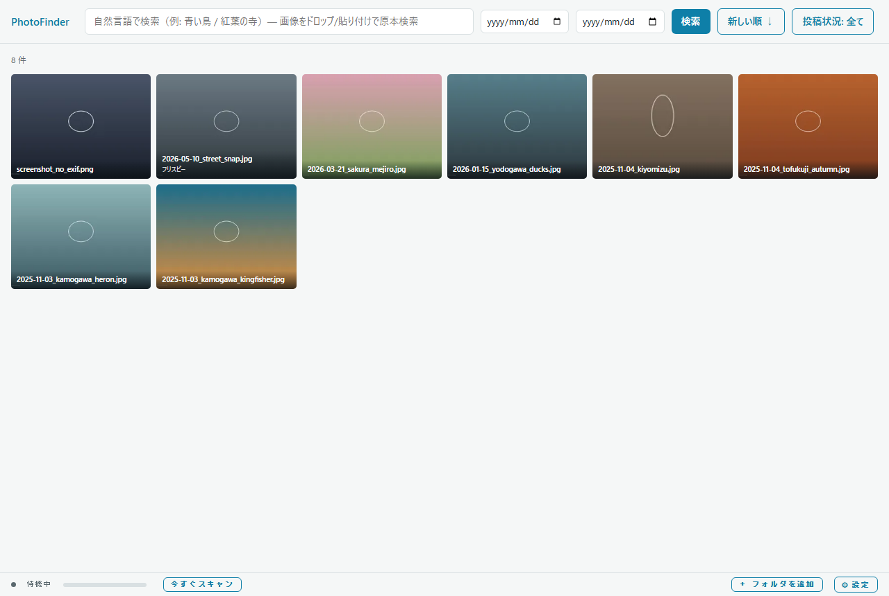
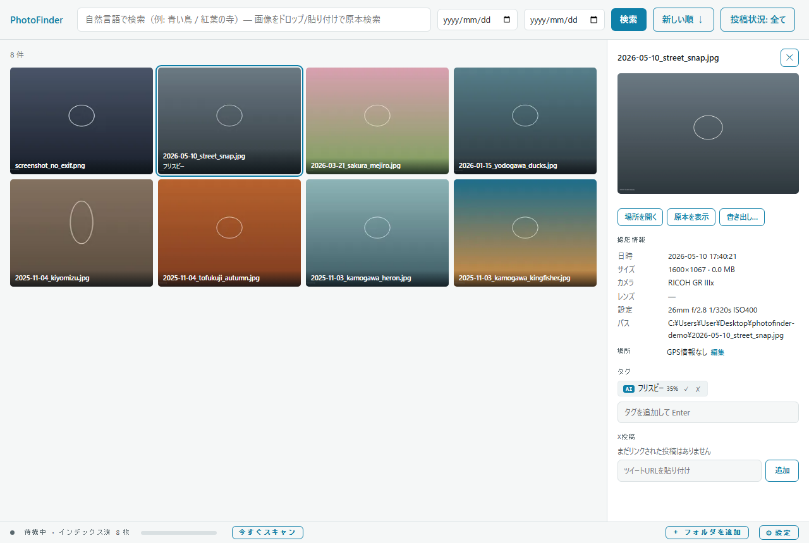

# PhotoFinder — ローカル写真 自然言語検索アプリ (Docker版)

PC ローカル / NAS 上の写真を **日本語の自然言語** と **画像例** で高速検索できる個人用アプリ。
外部サービス不要・完全ローカル動作がデフォルト。軽量・軽快を最優先した設計。

配布形態は**Docker専用(CPU/CUDA)**。**RAW対応**・**FAISS/RRF検索チューニング**・**人手タグの
データセット書き出し機能**を備える。

ライセンス: **AGPL-3.0**（[LICENSE](LICENSE) / 詳細は末尾「ライセンス」節参照）

<p align="center">
  
  
</p>

> 上記は動作確認用の合成テスト画像（`tools/make_sample_photos.py` 生成、実写ではない）による表示例です。

## コンセプト

- **1プロセス・1ファイルDB**: バックエンドは FastAPI 単一プロセス。メタデータは SQLite、ベクトルは FAISS（ローカルファイル）。Milvus 等のサーバ型 DB は使わない。
- **配布はDocker専用（CPU/CUDA）**: `Dockerfile` をビルド引数 `VARIANT=cpu|cuda` で2バリアントに作り分ける。CPU/GPUどちらの環境でも同じ手順で動かせる（[docs/docker.md](docs/docker.md)参照）。
- **推論は ONNX Runtime**: SigLIP2（多言語）埋め込み・物体検出・分類器をすべて ONNX 化。CUDA が使えない環境では自動的に CPU にフォールバックする仕組み（`photofinder/ml.py`の`ORT_PROVIDERS`）を持つ。実際にどちらで動いているかは設定画面の「AI処理」で確認できる。
- **重い処理はインデックス時に前払い**: 検索時は「ベクトル1本のエンコード + FAISS 検索 + SQLite フィルタ」のみ。10万枚規模で検索応答 < 200ms を目標。
- **原本非破壊**: 写真ファイルには一切書き込まない。タグ・メタデータはすべて DB 側に保持。

## 主要機能

以下は**実装済みで動作確認済み**の内容（当初の構想からの変更点は docs/design.md 冒頭の差分表を参照）。

| 機能 | 実装方針 |
|---|---|
| インデックス化 | フォルダ走査 + mtime/size/xxHash による差分検出。拡張子はユーザ設定（既定 `jpg;jpeg;png;heic`。**RAW対応**、下記参照）。フォルダごとに再帰/直下のみを切替可。起動時（設定でON/OFF可）または手動ボタンで実行、途中停止/再開・フォルダ単位の再スキャンに対応 |
| RAW対応 | `rawpy`によるカメラ埋め込みプレビュー抽出（フル現像はしない、`photofinder/raw_utils.py`）。CR2/CR3/NEF/ARW/ORF/RAF/RW2/DNG/PEF等が対象（既定セット。`ext_filter`の自由入力で追加可）。EXIFは`piexif`→（RAWで空なら）`exifread`の順に試行 |
| EXIF 抽出 | 撮影日時・GPS・カメラ/レンズ・露出情報を SQLite に保存。GPS はオフライン逆ジオコーディング（GeoNames）で都道府県/市区町村に、OSM POI 近傍検索で建物・スポット名に変換 |
| OCR | RapidOCR + japan_PP-OCRv3（ONNX, 日本語対応）。写真内テキストを全文検索対象に |
| 物体検出 | YOLOv8x(ONNX) で 80 クラス + 信頼度をタグ化。精度優先でnano→medium→xと変更（GPU (CUDA) 動作確認済み、CPUでも可） |
| 野鳥種名・色推定 | SigLIP ゼロショット（画像と種名/色のテキスト embedding の類似度）で種名・色タグを付与。専用分類器は学習しない。高確信時のみ自動タグ、それ以外は候補提示 |
| 建物・場所名 | GPS + ローカル POI データ(OSM Overpass 取得)の近傍検索。**都道府県単位で取得/削除、カスタム地点の手動追加/削除、写真ごとの場所名手動編集**が UI から可能。未取得地域の写真があれば取得を提案するバナーを表示 |
| 自然言語検索 | 日本語クエリ → ①FTS5 全文検索（タグ/OCR/種名/地名、SudachiPy分かち書き） ②SigLIP テキスト埋め込み → 画像ベクトル近傍検索、を RRF でスコア融合。フィルタの絞り込み強度に応じてFAISSのtop-kを200〜2000へ動的に広げる |
| 画像類似検索 | 例示画像をアップロード → SigLIP 画像埋め込みで近傍検索 + pHash 再ランク。SNS 縮小画像から原本特定にも使う（逆検索） |
| フィルタ | 日時範囲・GPS 矩形/地名・カメラ機種・拡張子・タグを SQL WHERE で併用。時系列の新しい順/古い順切替。書き出し状況（書き出し済み/未書き出し）でも絞り込み可能で、書き出し済みのみ表示中は書き出し日時順（最近書き出した順がデフォルト）に切り替わる |
| ビューワー | スクロールページングのサムネグリッド（ファイル名+タグ常時表示、書き出し済み/投稿済みバッジ、サムネイルサイズ小/中/大切替・次回起動時も設定を保持）、詳細パネル（自動タグ＋手動タグ編集＋場所編集。選択してもグリッドの列数は変化しない固定レイアウト）、ダブルクリックで原寸表示（画面サイズに合わせてフィット、GUIボタン/矢印キーで前後の写真に移動）、書き出し（枠ドラッグまたはピクセル数直接指定での切り出し・8方向透かし・フォント選択・設定記憶。前回の切り出し範囲も次回起動時に復元、範囲リセットボタンあり）。書き出しはコンテナ内に保存せずブラウザへ直接ダウンロードされる |
| SNS投稿リンク | 写真ごとにX/Instagram/その他SNSへの投稿URLを手動で紐づけ、重複投稿（クロップ/再アップ後の類似画像）をSigLIP類似度で警告。投稿状況で一覧を絞り込み可能 |
| データセット書き出し | ✓確定/✗否認した人手タグ付き写真を、教師/評価データセット用にJSONL+画像zipで一括書き出し（`POST /api/export/dataset`、設定画面から実行）。zero-shot分類の閾値再較正等に利用 |

## アーキテクチャ概要

```
┌─────────────────────── Docker コンテナ (CPU or CUDA) ───────────────────────┐
│                                                                            │
│  ┌────────────┐   HTTP (8686)   ┌───────────────────────────┐             │
│  │  Frontend   │ ◄─────────────► │  Backend (FastAPI, 1proc) │             │
│  │  静的HTML+JS│  REST + ポーリング │                           │             │
│  │ (ビルド不要)│                 │  ┌─ Search Service        │             │
│  └────────────┘                │  ├─ Indexer (worker queue) │             │
│                                 │  ├─ ML Runtime (ONNX)      │             │
│  /photos (ro bind mount) ──walk─►  └─ Thumbnail Service      │             │
│                                 └──────┬──────────┬─────────┘             │
│                                        │          │                       │
│                                 ┌──────▼───┐ ┌────▼────────┐              │
│                                 │ SQLite   │ │ FAISS index │              │
│                                 │ +FTS5    │ │ (.faiss)    │              │
│                                 └──────────┘ └─────────────┘              │
│                     /app/data (named volume): DB+サムネ+バックアップ         │
│                     /app/models (named volume): ONNXモデル                 │
└────────────────────────────────────────────────────────────────────────────┘
```

## リポジトリ構成

```
photofinder/
├── README.md                 ← 本ファイル
├── LICENSE                    ← GNU AGPL-3.0 全文
├── CLAUDE.md                 ← Claude Code 向けコードベース案内
├── requirements.txt / requirements-gpu.txt (CUDAイメージ用追加インストール)
├── Dockerfile                 ← マルチステージ (CPU/CUDA 2バリアント + model-fetch)
├── docker-compose.yml         ← cpu/cuda/setup の3プロファイル
├── .env.example                ← PHOTO_LIBRARY_PATH の設定例
├── .dockerignore
├── photofinder/              ← 実装本体（全機能この単一パッケージに実装）
│   ├── main.py                ← FastAPI サーバ（全 REST エンドポイント）
│   ├── scanner.py             ← 差分スキャナ + 抽出パイプライン（ML_VERSION でバックフィル制御）
│   ├── raw_utils.py            ← RAW埋め込みプレビュー抽出 (rawpy)
│   ├── dataset_export.py       ← 人手タグ付き写真のデータセット書き出し
│   ├── db.py / schema.sql     ← SQLite 接続・マイグレーション・スキーマ
│   ├── paths.py                ← models/data のパス解決
│   ├── exif_utils.py          ← EXIF 抽出（日時/GPS/カメラの正規化、RAWはexifreadフォールバック）
│   ├── ml.py                  ← SigLIP ONNX ランタイム（画像/テキスト埋め込み）
│   ├── vectors.py             ← FAISS ベクトルストア（追加/検索/再構築、HNSWパラメータ調整）
│   ├── fts.py                 ← 日本語分かち書き + FTS5 検索
│   ├── detector.py            ← YOLOv8x 物体検出（GPU (CUDA) 対応コードあり、既定はCPUフォールバック）
│   ├── bird.py / species_ja.py← 野鳥種名のゼロショット推定（種リストは自由に編集可）
│   ├── colors.py              ← 鳥の色タグのゼロショット推定
│   ├── ocr.py                 ← RapidOCR 日本語 OCR
│   ├── geo.py / poi_fetch.py  ← 逆ジオコーディング・OSM POI 取得/検索/手動管理
│   ├── export.py              ← 切り出し/透かし/メタデータ除去での書き出し（RAW対応・Linux CJKフォント）
│   ├── backup.py              ← フルバックアップ作成/復元（DB+FAISS+サムネ等）
│   └── static/index.html      ← フロントエンド（ビルド不要のバニラ JS、単一ファイル）
├── tools/
│   ├── download_models.py    ← SigLIP/YOLO/OCR モデルの取得（Dockerのmodel-fetchステージから利用）
│   ├── build_poi_db.py       ← OSM POI データの CLI 取得（UI からも同機能を実行可）
│   ├── make_sample_photos.py ← EXIF/GPS 付きサンプル写真の生成
│   ├── fetch_test_photos.py  ← 実写テスト画像の取得（開発用）
│   └── evaluate_dataset.py   ← データセット書き出し(POST /api/export/dataset)の
│                                 結果を解析し、AI自動タグの確定/否認率・YOLO信頼度
│                                 しきい値の感度分析・種名マージン分析を表示する
├── docs/
│   ├── design.md             ← 詳細設計書（当初案からの差分表 + その後の追加変更）
│   ├── api-spec.md           ← REST API エンドポイント仕様
│   ├── data-schema.md        ← ER 図 + SQLite DDL + FAISS/POI DB 構成
│   ├── docker.md              ← Docker配布の詳細（ビルド・ボリューム・公開範囲・トラブルシュート）
│   ├── third-party-notices.md ← 依存ライブラリ/モデル/データのライセンス一覧
│   │                             （公開・配布前に要確認。YOLOv8x/LibRaw/libx265の注意点あり）
│   └── third-party-licenses/ ← 同梱ライブラリ本体のライセンス全文（例: x265-COPYING.txt）
├── samples/                  ← 参照実装（未接続・現行 API との乖離あり）
│   ├── python/                ← ハイブリッド検索・フルインデクサの別実装例
│   └── typescript/            ← React 版 UI 案（apiClient.ts / SearchView.tsx）
└── data/, models/             ← 実行時生成（Dockerではnamed volume。バックアップ対象はdata/のみ）
```

## 技術スタック（軽量優先の選定理由）

| 層 | 採用 | 理由 / 代替 |
|---|---|---|
| 埋め込み | **SigLIP2** `google/siglip2-so400m-patch14-384` (ONNX, 1152d, 384px) | 日本語含む109言語(WebLI)対応。代替: `stabilityai/japanese-stable-clip`（日本語特化・高精度だがやや重い） |
| ベクトル検索 | **FAISS** `IndexHNSWFlat`（〜50万枚、efConstruction/efSearch調整済み）/ `IVF+PQ`（それ以上） | サーバ不要・ファイル1個。Milvus は個人用途にはオーバースペック。代替: `sqlite-vec`（SQLite に一本化したい場合） |
| メタデータ/全文 | **SQLite + FTS5** (unicode61 + 分かち書き前処理) | 1ファイル・トランザクション・バックアップ容易 |
| OCR | **RapidOCR**（検出）+ **japan_PP-OCRv3**（認識, ONNX） | 日本語対応・追加学習不要ですぐ使える |
| 物体検出 | **YOLOv8x** (ONNX) | 精度優先。GPU (CUDA, Docker cudaバリアント) 前提のサイズ選定 |
| 鳥種名・色タグ | **SigLIP ゼロショット**（画像embedding と種名/色のテキストembeddingの類似度）。専用分類器は学習しない | 既製の Kaggle 525 種分類器は日本の普通種（カワセミ等）を含まず近縁種に誤答したため不採用。理由と閾値設計は `photofinder/bird.py` docstring 参照 |
| RAW | `rawpy`（実装済み） | 埋め込みプレビュー抽出のみ（フル現像はしない）。`LibRaw`(LGPL-2.1)を動的リンクで同梱 |
| HEIC | `pillow-heif`（実装済み） | Linuxホイールも `libx265.so` を同梱（デコード専用で未使用、docs/third-party-notices.md参照） |
| フロント | 静的 HTML + バニラ JS（ビルド不要、実装済み） | React+Vite 版は samples/typescript/ に参照実装。デスクトップ化する場合は Tauri（構想） |
| 配布 | **Docker** (CPU/CUDA 2バリアント、1つのDockerfileから作り分け) | Windows exe (PyInstaller) 配布は廃止。CPU/CUDA分離の理由は docs/docker.md 参照 |

## クイックスタート (Docker)

```bash
cp .env.example .env
# .env を編集し PHOTO_LIBRARY_PATH をホスト側の写真フォルダに設定

# モデル取得（初回のみ、SigLIP2/YOLOv8x/OCR 計約1.5GB）
docker compose --profile setup run --rm model-fetch

# 起動（CPU環境）
docker compose --profile cpu up -d
# 起動（NVIDIA GPU環境。要 nvidia-container-toolkit）
docker compose --profile cuda up -d
```

`http://127.0.0.1:8686` をブラウザで開く。

**フォルダ登録のコツ**: UI右下の「＋ フォルダを追加」に入力するパスは、Windows/WSLのパスでは
なく**常にコンテナ内パス** `/photos/...` から書くこと。`.env`の`PHOTO_LIBRARY_PATH`（ホスト側の
実パス）が丸ごとコンテナ内の`/photos`にマウントされる仕組みなので、たとえば

```
PHOTO_LIBRARY_PATH=/mnt/c/Users/yourname/Pictures
```

と設定した場合、UIには `/photos`（Pictures直下すべてを対象にする）や `/photos/2026`
（特定サブフォルダのみを対象にする）のように、`/photos`を起点にしたパスを入力する
（ホスト側の実パス `C:\Users\...` や `/mnt/c/Users/...` をそのまま入力しても認識されない）。
WSL環境での運用のコツやホストフォルダを複数登録する方法は [docs/docker.md](docs/docker.md) 参照。

既定では `127.0.0.1` にのみポートが公開され、認証機構は無い。LAN/インターネットへの公開は
`docker-compose.yml` の `ports:` を変更すれば可能だが、アクセス制御は利用者の責任になる
（[docs/docker.md](docs/docker.md)「ネットワーク公開範囲」参照）。

### NAS (SMB) 上の写真を使う場合（参考情報）

Dockerのbind mount（`PHOTO_LIBRARY_PATH:/photos:ro`）はDockerホストの**ローカルディレクトリ**を
そのままコンテナに渡すだけで、SMBを直接しゃべるわけではない。そのためNAS上の写真を使うには、
先にDockerホスト（Linux）側でSMB共有をOS標準の方法でマウントし、そのマウント先を
`PHOTO_LIBRARY_PATH` に指定する必要がある（WindowsのようにUNCパス`\\NAS\photo`を直接
指定することはできない）。

```bash
# cifs-utils (Ubuntu/Debian系)
sudo apt-get install -y cifs-utils

# 認証情報はマウントコマンドの引数に直接書かず、権限を絞ったファイルに分離する
sudo mkdir -p /etc/samba/credentials
sudo tee /etc/samba/credentials/nas-photos > /dev/null <<'EOF'
username=your-nas-user
password=your-nas-password
EOF
sudo chmod 600 /etc/samba/credentials/nas-photos

# マウント先ディレクトリを用意して一時マウント
sudo mkdir -p /mnt/nas-photos
sudo mount -t cifs //nas-host/photos /mnt/nas-photos \
  -o credentials=/etc/samba/credentials/nas-photos,uid=$(id -u),gid=$(id -g),vers=3.0,ro
```

`.env` の `PHOTO_LIBRARY_PATH` を `/mnt/nas-photos` に設定すれば、以降は通常のクイックスタートと
同じ手順で起動できる。`-o ro` はホスト側マウント自体を読み取り専用にする指定（Docker側の
`:ro` bind mountと二重に保護される）。

**再起動後も自動マウントしたい場合**は `/etc/fstab` に追記する:

```
//nas-host/photos /mnt/nas-photos cifs credentials=/etc/samba/credentials/nas-photos,uid=1000,gid=1000,vers=3.0,ro,_netdev 0 0
```

（`_netdev` はネットワークが上がってからマウントを試みるオプション。`uid`/`gid`は`id -u`/`id -g`の
数値をそのまま書く。）

**WSL2環境の注意**: WSL2はLinux仮想マシンなので、Windows側で「ネットワークドライブの割り当て」
した共有（`Z:\` 等）をそのまま使うのではなく、上記のように **WSL2のLinux側から直接**
`mount -t cifs` する方が安定する。NAS側がNFSにも対応しているなら、`nfs-common`
パッケージ + `mount -t nfs` の方がSMBより単純でLinuxとの相性も良いので、選べるなら検討する
価値がある。

## ローカル開発（Dockerを使わない場合、Linux限定）

```bash
python3 -m venv .venv
.venv/bin/pip install -r requirements.txt

.venv/bin/pip install huggingface_hub ultralytics
.venv/bin/python tools/download_models.py
.venv/bin/pip uninstall ultralytics torch torchvision -y

# 任意: CUDA高速化 (Dockerのcudaバリアントと同じ組み合わせ)
.venv/bin/pip uninstall onnxruntime -y
.venv/bin/pip install -r requirements-gpu.txt

.venv/bin/python -m uvicorn photofinder.main:app --port 8686

# 動作確認用のサンプル写真（EXIF/GPS付き）を生成する場合
.venv/bin/python tools/make_sample_photos.py
```

`GET /api/index/status` の `providers` フィールドで実際の実行プロバイダ
（`CUDAExecutionProvider` / `CPUExecutionProvider`）を確認できる。CUDA関連パッケージが
無い環境では例外にならず黙ってCPUにフォールバックするだけなので、この手順を踏まなくても
通常のクイックスタートと同じ動作をする。

## 実装状況

**M1〜M5完了**（走査・EXIF・埋め込み検索・物体検出/OCR・野鳥/場所名/バックアップ、詳細は
docs/design.mdの差分表参照）。

**主な実装内容**:
- **配布はDocker専用** — `Dockerfile`をビルド引数`VARIANT=cpu|cuda`でCPU/CUDA 2バリアントに
  作り分け。モデル取得はアプリイメージのビルド/起動ライフサイクルから独立した
  `model-fetch`サービスに分離
- **RAW対応** — `rawpy`の埋め込みプレビュー抽出（フル現像はしない）で実装。CR2/CR3/NEF/ARW/
  ORF/RAF/RW2/DNG/PEF等が対象。EXIFは`piexif`→（RAWで空なら）`exifread`の順にフォールバック
- **FAISS/RRFチューニング** — HNSWの`efConstruction=200`設定、`efSearch`のクエリ`k`に応じた
  動的設定、フィルタ絞り込み強度に応じたtop-k動的拡張（200〜2000）
- **データセット書き出し** — 既存の確定/否認タグ機構（`photo_tags.verified`）を人手の正解
  データとして扱い、`POST /api/export/dataset`で教師/評価データセット用のJSONL+画像zipを
  書き出す機能
- **その他** — 透かし書き出しのフォントをLinux/Noto Sans・Serif JPに対応、コンテナ実行時は
  「エクスプローラで開く」系UIを自動的に非表示化。写真書き出し・データセット書き出しは
  コンテナ内に保存せずブラウザへ直接ダウンロードさせる方式で、コンテナ内にダウンロード後の
  データを残さないようにしている

## 運用方針（要約 — 詳細は docs/design.md §8）

- **差分インデックス**: `(path, size, mtime)` 一致ならスキップ。変更検知時のみ xxHash 再計算。ハッシュ一致（移動/リネーム）はレコード付け替えのみで ML 再処理なし。
- **スキャンのタイミング**: 起動時（設定で無効化可）と手動ボタンのみ。watchdog によるリアルタイム監視・定期スキャンは実装の単純さを優先して不採用。
- **プライバシー**: 既定は完全ローカル。クラウド OCR / オンライン逆ジオコーディングは設定で明示オプトイン。**認証機構は無く**、公開範囲は`docker-compose.yml`の`ports:`マッピングで制御する（既定は127.0.0.1のみ、詳細はdocs/docker.md）。
- **バックアップ**: 設定画面から手動でフルバックアップ（DB・FAISS索引・サムネ/プレビュー・poi.db等、データディレクトリ全体）をzipでダウンロード/復元できる。復元前にライブデータを自動退避（直前1世代）してから展開し、復元後はプロセスを終了してDockerのrestart policyで再起動する。自動の週次スナップショットは廃止済み（Dockerでは`data`named volume）。

## 参考にした類似ソリューションの設計思想

- **PhotoPrism**: Go 単一バイナリ + TensorFlow でローカル完結。「原本非破壊・サイドカー的メタデータ」の思想を踏襲。
- **Immich**: ML をマイクロサービス分離し CLIP 検索を提供。本設計では個人用途向けに**同一プロセス内 ONNX** に簡素化。
- **Apple Photos / Google Photos**: 「インデックス時に重い解析を済ませ、検索は軽く」という前払いモデル。オンデバイス ML の方向性は Apple 方式に近い。
- **Digikam**: 顔認識・タグ DB のローカル管理。SQLite 一本のメタデータ管理はここから。

## ライセンス

Copyright (C) 2026 MeiNogizaka

**GNU Affero General Public License v3.0 (AGPL-3.0)**。全文は [LICENSE](LICENSE) を参照。

物体検出に使用している YOLOv8x（Ultralytics）の学習済みモデルが AGPL-3.0 の対象であり
（Ultralytics 公式方針: 学習済みモデルは既定で AGPL-3.0、商用の非公開配布には別途
Enterprise License が必要）、本アプリを配布・公開する以上その条件に合わせる必要があるため、
PhotoFinder 自体もこのライセンスを選択している。RAW対応で追加した `rawpy` が動的リンクで
同梱する `LibRaw` は LGPL-2.1（既にAGPL-3.0のプロジェクトへの追加はライセンス選定に影響しない）。

AGPL-3.0 は通常の GPL と異なり、**ネットワーク経由でソフトウェアと対話できるようにした
時点で**（配布していなくても）ソース開示義務が生じる「ネットワーク条項」（第13条）を持つ。
本アプリは既定で `127.0.0.1` にのみポートを公開する構成だが、`docker-compose.yml`の
`ports:`設定を変更してLAN/インターネットに公開する場合は、この条項の対象となることに留意すること。

依存ライブラリ・学習済みモデル・外部データそれぞれの詳しいライセンス一覧は
[docs/third-party-notices.md](docs/third-party-notices.md) を参照。

## メンテナンス方針・免責事項

本プロジェクトは作者が個人の用途のために開発しているものであり、更新・修正・機能追加は
**作者の都合・ペースに委ねられる**。Issue/PRへの対応や、特定の環境・要望に合わせた
継続的なメンテナンスを保証するものではない。

本ソフトウェアは AGPL-3.0 ライセンスの定めるとおり、**いかなる保証もなく現状のまま
("AS IS") 提供される**（詳細は [LICENSE](LICENSE) 第15〜16条参照）。本ソフトウェアの
利用によって生じたデータの損失・破損、プライバシー上の問題、その他あらゆる損害について、
作者は一切の責任を負わない。利用は自己責任で行うこと。
